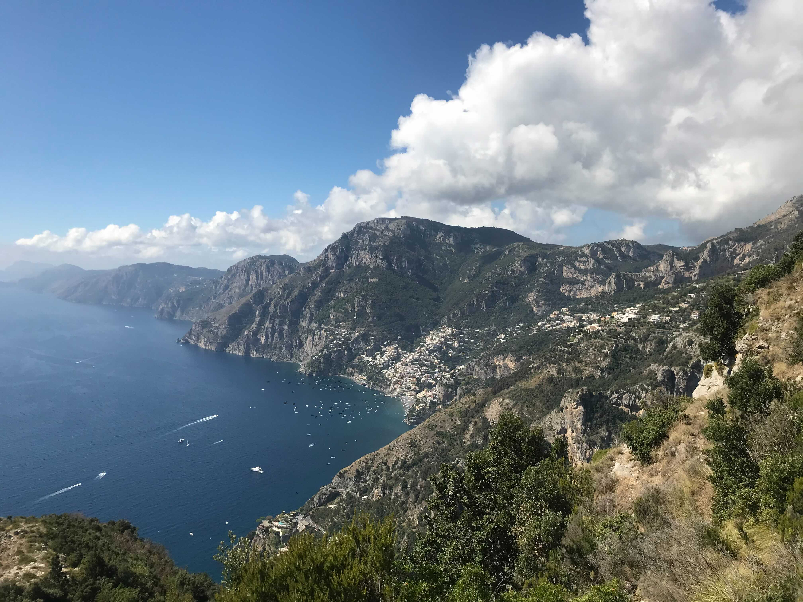

### Hello there! 👋

I'm Bryan Helms, and I work on Octoservices at GitHub.

#### Primary Experience
- C# and .NET Core
- TypeScript, Node.js, and React
- Distributed Systems on Docker and K8s

#### More Info About Me
Feel free to check out [my website](https://bryanhelms.com/) to learn more details about me, and [why you should hire me](https://bryanhelms.com/cv/).

#### Things I'm Currently Learning
- Go and Interpreters, following allowing with [Writing An Interpreter in Go](https://interpreterbook.com/).
- I'm also interested in Rust and dabble in it from time to time.
